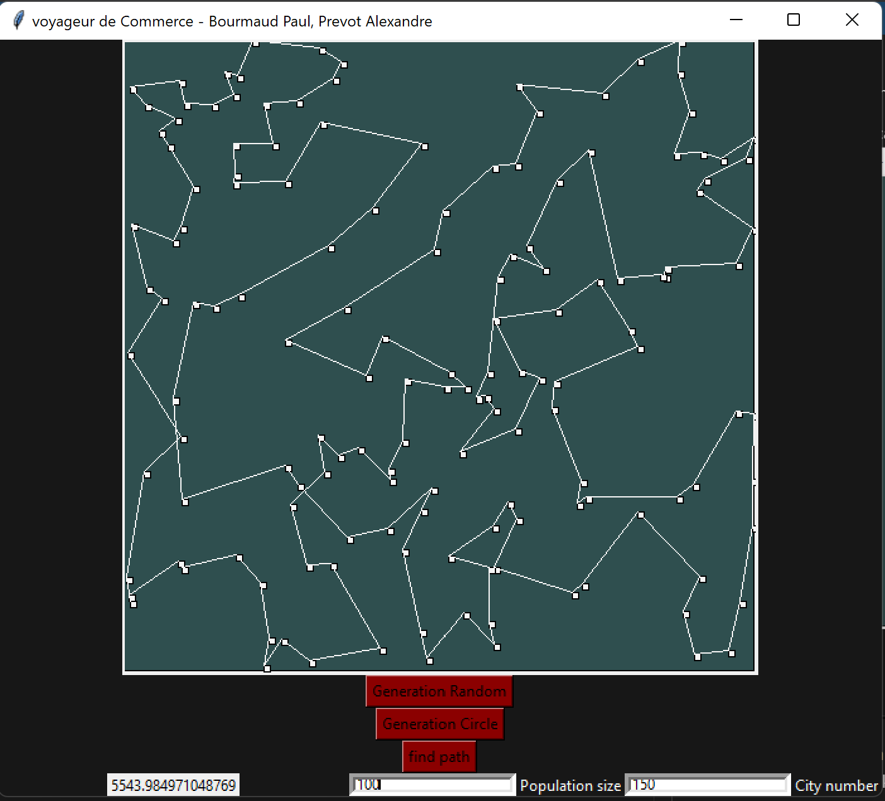
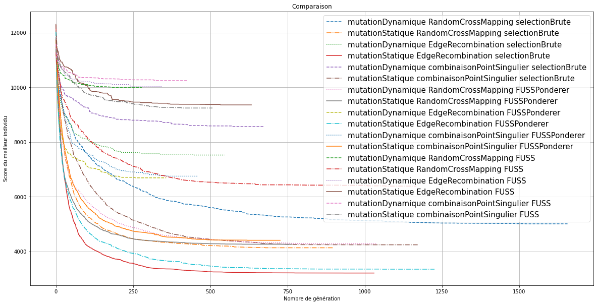

# Traveling Salesman Problem solved with Genetic Algorithm
---
## Presentation

#### Travelling salesman problem
---
Travelling Salesman problem is a very famous problem in combinatorial optimisation in wich it is asked to find the shortest path passing through each point a SINGLE time. It has been proven to be a NP-Complet problem.

#### Genetic Algorithm
---
Genetic Algorithms are methods for solving optimization problem based on a natural selection process to mimics biological evolution.
https://www.sciencedirect.com/topics/engineering/genetic-algorithm#:~:text=A%20genetic%20algorithm%20(GA)%20is,process%20that%20mimics%20biological%20evolution.

#### This project
---
It is then possible to approximate the optimal result on the TSP problem with genetic algorithm. This repository offers an implementation of this solution. More precisly it uses genetic algorithm with the Edge Recombination Operator for the crossover wich has been proven to be very efficient for this context.

#### The program
---
The program offers a front_end developped with python. All calculations are performed on a C++ precompiled binary called by the python program when you ask it to.

Computing is also performed on a multi-threaded environment using openMP to speed up the computation.

---
## Run the program
To run the program you must have python 3.10 installed.

You then need to call ```python AlgoGen.py``` to see this window :


1. ```Generation Random``` Generates a random set of point with the number of cities you asked in ```city number```
2. ```Generate Circle``` Generates it in circles.
3. ```find path``` Finds a good path for the current set of points

At the end, you should have a result similar to this :



### Research

In order to provide good results, many methods have been tested among the most known algorithms in Genetic Algorithms applied on TSP problems.

Our results are here :


The best combination of methods we've found is :
 1. Elitisme with a strong selection pressure.
 2. Edge Recombination operator
 3. Simple swap mutation with a static mutation rate

 Good results were obtained with weighted FUSS with a strong favority for fittest individuals too.